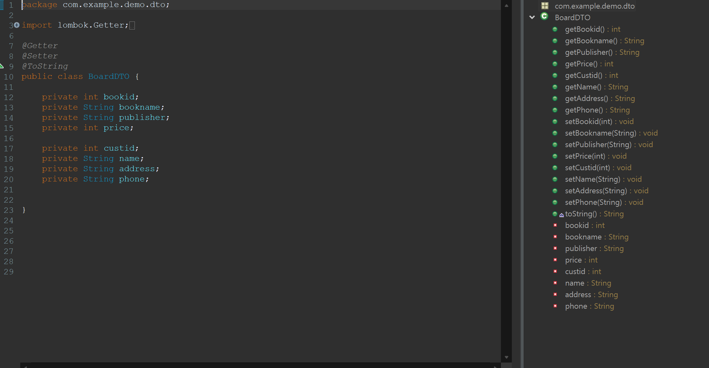
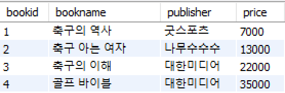
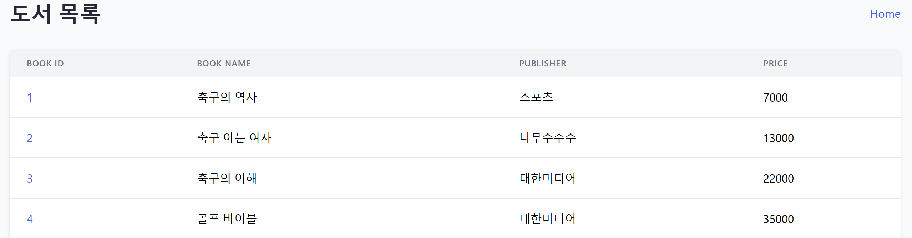
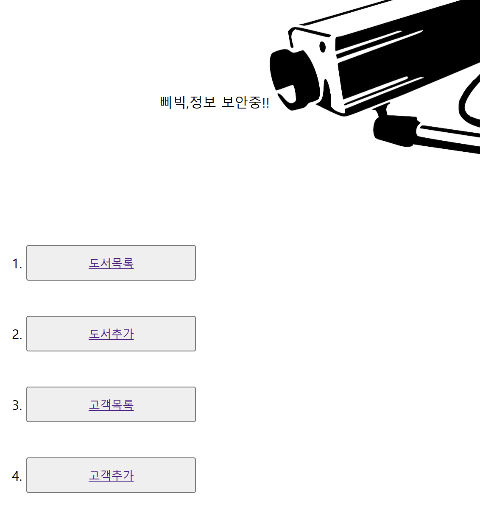
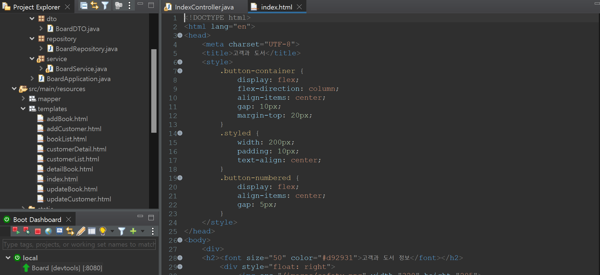

# PortFolio

## 📒 목차

1. [❓ 프로젝트 개요](#❓-1.-개요)
2. [🕵️‍♂️ 개발 설계](#🕵️‍♂️-2.-개발-설계)
3. [💻 주요 기술](#💻-3.-주요-기술)
4. [🖥️ 수집 데이터](#🖥️-4.-수집-데이터)
5. [ℹ️ 데이터 속성 결과](#ℹ️-5.-데이터-속성-결과)
6. [👨‍💻 시스템 개발](#👨‍💻-6.-시스템-개발)
7. [❗ 구현](#❗-7.-구현)

-----
-----
# 프로젝트 개요
-  착수 배경: 다량의 도서 정보와 고객 정보를 통합 관리함으로써 사용자들이 좀 더 효율적으로 필요한 정보를 검색하고 관리할 수 있는 웹 플랫폼을 제공하기 위함.

-  기간: 2024.08~2024.11(3M/M)

# 개발 설계

- SQL속 데이터를 Eclipse로 연동 

- 데이터 정보 수정 용이하게 적용
### 주요 기술
1. MySQL
- 관리 시스템, 각 데이터 정리 및 관리
---
2. JavaScript
- 동적 동작, 상호 작용 처리
---
3. SpringBoot
- 백엔드 시스템 구축, API 제공
---
4. HTML/CSS
- UI 구조 및 디자인 표현

# 수집 데이터
1. 고객 정보 데이터(customer)
----------
2. 도서 정보 데이터(book)

# 데이터 속성 결과

-  custid: 각 고객별 고유 식별 번호
-  name: 각 고객별 이름
-  address: 각 고객별 현 실제 거주 주소
-  phone: 각 고객별 실제 사용 번호
---

-  bookid: 각 도서별 고유 식별 번호
-  bookname: 각 도서별 제목
-  publisher: 각 도서의 출판사
-  price: 각 도서의 가격 정보
-----
# 시스템 개발
 도서관 정보 관리를 위한 통합 플랫폼으로, SQL 데이터베이스에 저장된 도서 정보와 고객 정보를 Eclipse 개발 환경에서 연동하여 관리 용이. 사용자는 웹 브라우저를 통해 다양한 작업 수행 가능.

 
- 추가 기능을 통해 원하는 정보를 쉽게 추가 가능 
-----

- 도서 정보에는 도서 고유 번호, 제목, 출판사, 가격 등의 데이터가 포함되어 있어, 사용자가 필요한 정보를 빠르게 확인 가능.
-----

-  사용자는 웹 상에서 도서 관리, 고객 정보 확인 등 다양한 작업을 편리하게 수행 용이.

-----
# 구현
- 메인화면

- 코드 화면

